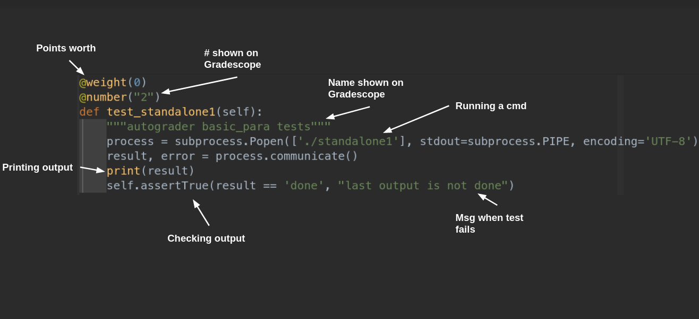

# Gradescope Setup

Configurations for setup and writing tests in CSSE332 Gradescope.

##### Table of Contents  
* [Gradescope filesystem](#filesys)  
* [Installing dependencys](#deps)  
* [adding a new assignment](#newHw)  
    * [writing tests](#tests)  
    * [writing for xv6 labs](#xv6Tests)  
    * [writing for test_integration.py](#integrationTests)  
    * [downloading submissions](#download)
* [running tests](#runningTests)  
    * [running tests localy](#runningLocaly)  
    * [running in gradescope](#runningOnGrade)  
* [uploading to gradescope](#upload)  

<a name="filesys"/>  

## Gradescope filesystem
<pre>
/autograder
├──  run_autograder            (main script that runs)
├──  submissions               (where student submissions are)
├──  results                   (where the output .json file goes)
└──  source            
    ├──  requirements.txt      (python dependencys)
    ├──  run_autograder        (same file again ¯\_(ツ)_/¯)
    ├──  run_tests.py          (main python file that runs all tests)
    ├──  setup.sh              (first file that runs in gradescope & sets up dependencys)
    ├──  src                   (work folder, explaned more in "writing test" section)
    └──  tests                 (folder with all tests)
        ├──  test_files.py
        ├ ... (other tests)
        └──  test_grading_script.py
</pre>

<a name="deps"/>  

## Run order
(idk some harness stuff)->run_autograder -> setup.sh -> tests_setup.sh -> run_tests.py -> test_files.py, test_grading_script.py, test_integration.py

## Dependencies
python 3.7 or greater

<a name="newHW"/>  

## Adding a New Assignment
Copy and paste the `template` folder in `hw` and rename it to whatever

<a name="tests"/>  

### Writing Tests

Each assignment folder has this
<pre>
/autograder
├──  run_tests.py                      (doesn't rly matter, just runs all tests and formats output)
├──  requirements.txt                  (python dependences)
├──  src                               (student's work and hw source files)
└──  tests                             (folder with all tests)
    ├──  test_files.py                 (checks if student submitted all files)
    ├──  test_leaderboard.py           (leaderboard that I have yet to use :') )
    ├──  test_integration.py           (my over engineried autograder :) )
    └──  test_grading_script.py        (output checking)
</pre>

Mainly write unit tests in `test_grading_script.py`

Copy the template test in `test_grading_script.py`

    
 Unit test format 

Write test follow python untests format:  

* to write test there must be a dir called `tests` next to the `run_tests.py` file
* inside the `tests` dir each file must have `test_...` in the name
* there must be a gradescope_utils class imported
* each test **must** start with prefix `test_...`

##### REMEMBER: tests must start with `test_...` prefix in func name 
(sry this just caused a lot of pain for me)

##### ALSO REMEMBER: put `os.chdir(src) somewhere cuz all the student work is in src`
This is cuz `run_tests.py` is running the tests so it is one directory up.

<a name="xv6Tests"/>  

### writing tests for xv6 labs
follow the c_review as a template guide
copy .glbinit.tmpl... into src
copy `grade-lab-5.py`'s code into `test_grading_script.py`
copy all the imports in c_review's `test_grading_script.py` 
copy `gradelib.py` into the test dir
write multiple tests for gradescopes autograder by checking the `TESTS` array (look at c_review `test_grading_script.py` as a guide)

<a name="integrationTests"/>  

### writing tests for test_integration.py
this file is my atempt at over enginering something bc i wanted to be lazy when grading
NOTE: `*` and `.` need to be escaped or else it will break re

<a name="download"/>  

### downloading submissions

<a name="runningTests"/>  

## Running Tests

<a name="runningLocaly"/>  

### running tests localy
You should run from top dir of the assignment
For example to run `test_grading_script.py` for c_review run `python3 tests/test_grading_script.py`

<a name="runningOnGrade"/>  
### running tests in grade scope

<a name="upload"/>  

## Uploading to Gradescope
the bare minimum gradescope needs is a zip file with `run_autograder` and `setup.sh`

To setup which assignment to grade go into `setup.sh` and change the
variable `assignment` to a directory name in the `hw` directory.

To upload to gradescope just zip `run_autograder` and `setup.sh` in a file and
upload

(image)

* bc of src dir rembember to put `os.chdir("src")` somewhere in your python test files

###### random note:
gradescope does not print ps -a for what ever reason idk so for simple shell gud luck

unit tests run in alphabetic order
##### TODO:
* custom code highlights for specific functions
* provide default file if file not submitted
* use subprocess.run() for everything along with input [link](https://stackoverflow.com/questions/39187886/what-is-the-difference-between-subprocess-popen-and-subprocess-run)
* add try catch block for xv6 runner
* if file not uploaded do a try catch statment and don't run tests
* set timers for test if they loop forever
* make set contains
* test fail help msg
* check for over sending files
* set up automatic styling and deadspace removal for integration tests
* implement partial credit
* setup github deploy_key
* change hw dir name to tests
* change assignment dir (in hw) to have labXX_ prefix
* run valgrind
* remove unwanted files from submition so gradescope does not display them
* some weird timeout OK msg from xv6 grader `== Test buddy_allocator, test basic alloc == Timeout! buddy_allocator, test basic alloc: FAIL (30.1s) `
* make running localy easy
* set up template dir correctly
* if any bash file errors stop everything
* use buildx for docker
* formatter for student code?
* consider trying to get around output buffering: `python3 -c "import os; os.system(\"./coffee_pot.bin\")"`
* add funny easter egg 1/100 art peepe printout
* add helpful err msg ex: if it cant find the assignment name/folder
* increase cpu number in grade scope
